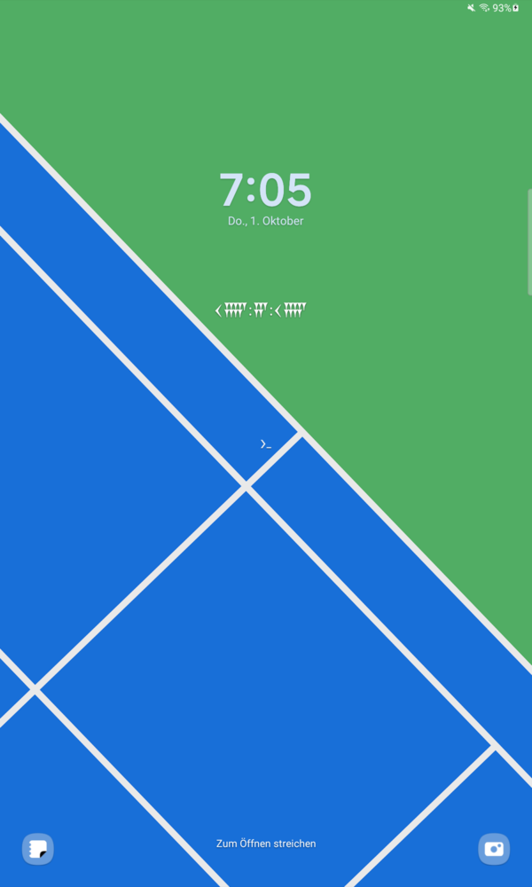

# utcuneiform: Sumerian Clock for Android

Your local time in cuneiform numerals, drawn straight onto the Android lockscreen as a live
wallpaper. It doesn't need LockStar or any other widget host. A transparent home-screen widget
is also included.

Inspired by [Oisín Moran's sumertime](https://oisinmoran.com/sumertime).

<p align="center"></p>

## Numeral systems

| System | What it shows |
| --- | --- |
| Sexagesimal h · m · s | Modern 24-hour time in Babylonian base-60 digits (GEŠ2 units, U tens) |
| Bēru · UŠ · NINDA | Babylonian astronomical time: 12 bēru a day, 30 UŠ (4 min) a bēru, 60 NINDA (4 s) an UŠ |
| Fraction of the day | Elapsed day as sexagesimal fractions (1/60 day = 24 min, 1/3600 = 24 s) |
| Sumerian ŠAR count | Seconds (or minutes) since midnight in the additive 1/10/60/600/3600/36000 system |

Options include the Late Babylonian zero placeholder 𒑲, starting the day at sunset (≈18:00),
showing or hiding seconds, the colour, size and height of the clock, and the background image.

Fast-changing fields get a fixed-width, left-aligned slot. The slower fields to their left
never move, and the clock avoids the wide gaps that right-aligned slots leave.

## Building

`build.py` builds and signs the APK without Gradle. It expects:

- `toolchain/jdk-17.0.20.1+1/`: a JDK 17
- `toolchain/android-15/`: Android build-tools (aapt2, d8, zipalign, apksigner)
- `toolchain/android-13/android.jar`: the API 33 platform

It generates `signing.keystore` and `signing-password.txt` on the first run. Keep both private.

```sh
python3 build.py
adb install -r SumerianClock.apk
```

Open the app and tap **Set as lockscreen wallpaper**. On Samsung One UI, choose
"Home and lock screens"; the clock stays hidden on the home screen unless you enable it.
"Use current wallpaper" reads the system's copy of the wallpaper with root when root is
available, so preloaded Samsung wallpapers come out right.

## License

Typeface: Noto Sans Cuneiform, SIL Open Font License (`app/assets/FONT-LICENSE.txt`).
